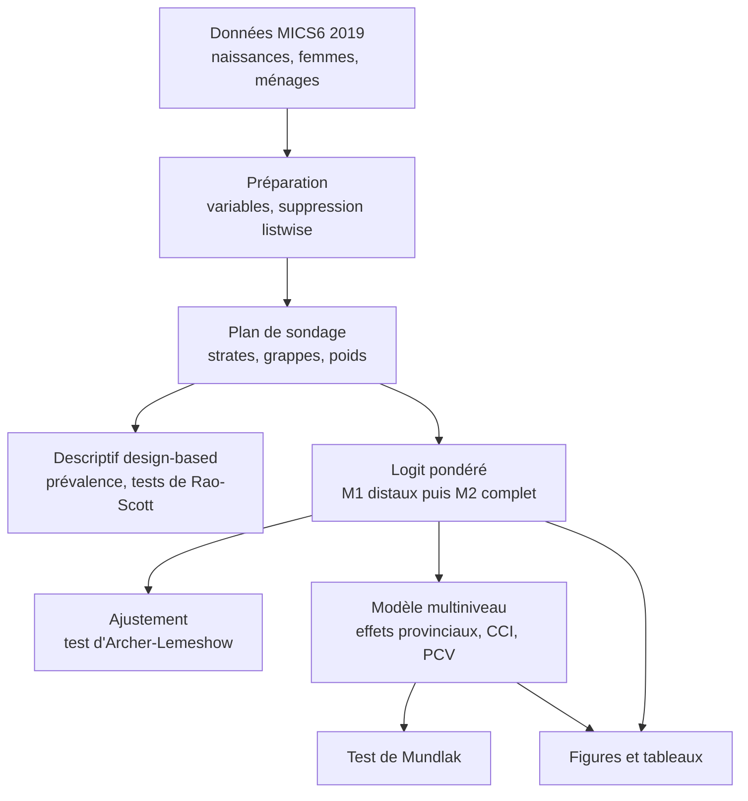
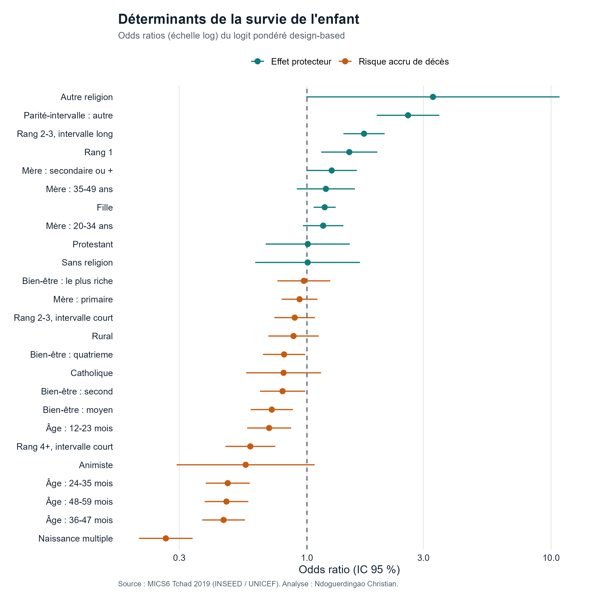
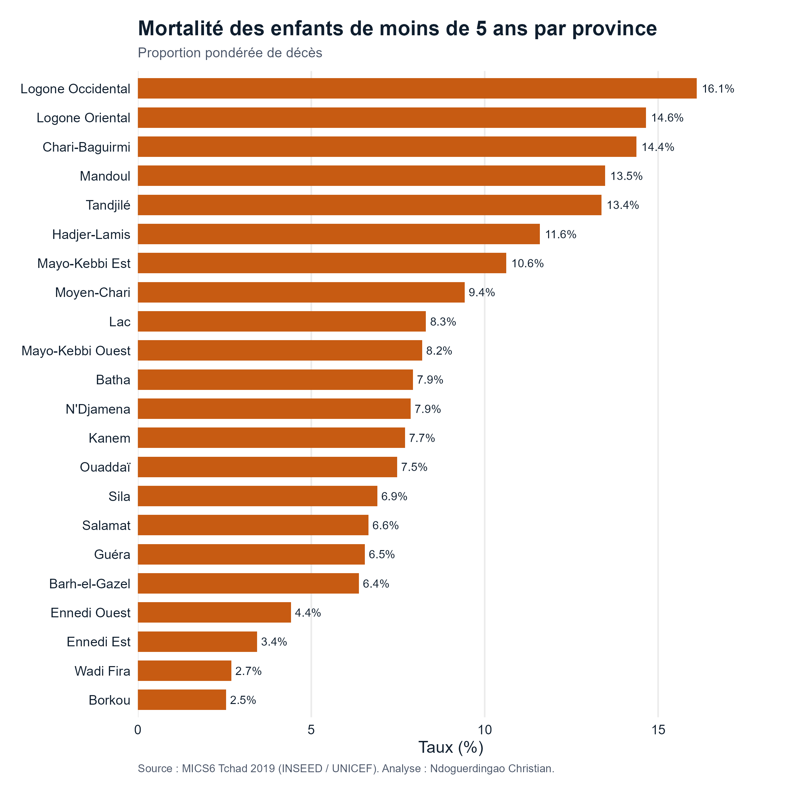
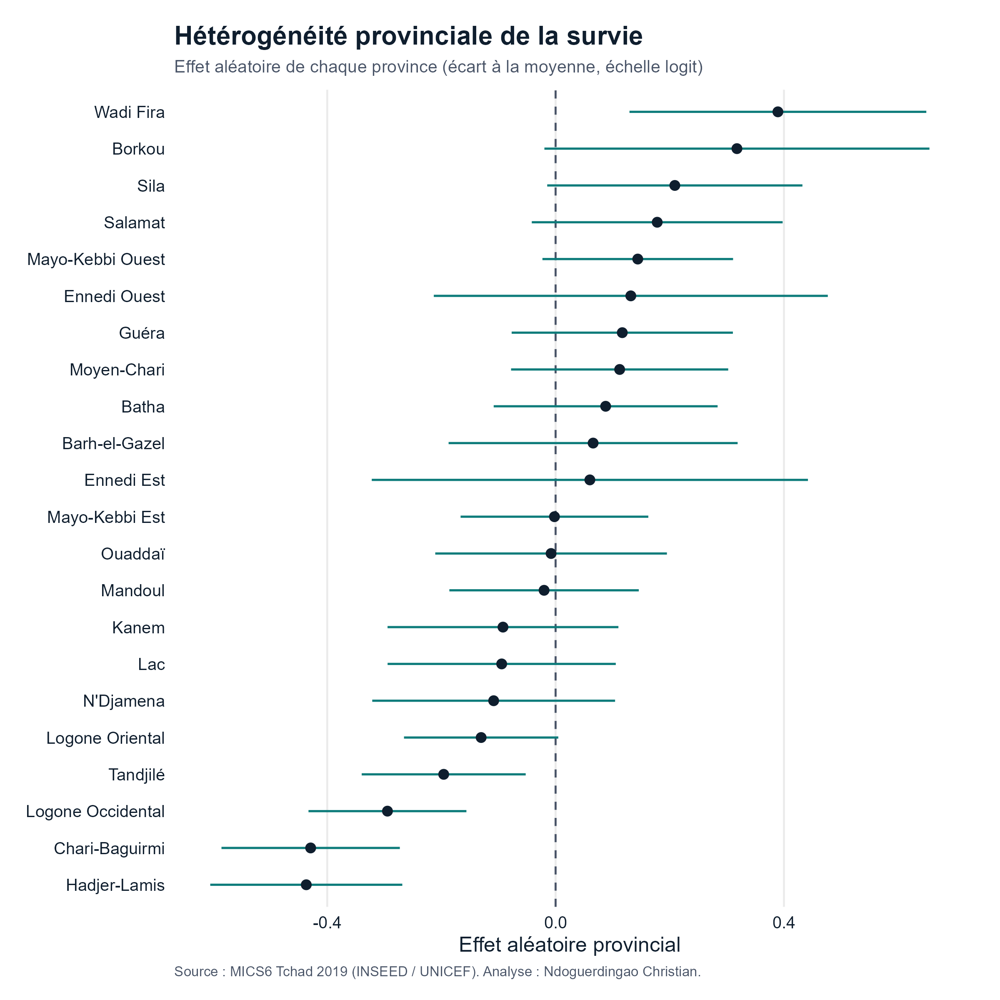

<!--
====================================================================
 README - mortalité-enfants-tchad-mics6
====================================================================
-->

<h1 align="center">Déterminants de la mortalité des enfants de moins de cinq ans au Tchad</h1>

<p align="center"><b>Analyse design-based des données d'enquête MICS6 (2019) : logit pondéré et modèle multiniveau à effets aléatoires provinciaux, entièrement reproductible sous R.</b></p>

<p align="center">
  
  
  
  
</p>

<p align="center">
  <a href="#en-bref">En bref</a> ·
  <a href="#le-problème">Problème</a> ·
  <a href="#les-données">Données</a> ·
  <a href="#la-démarche">Démarche</a> ·
  <a href="#les-résultats">Résultats</a> ·
  <a href="#reproduire">Reproduire</a>
</p>

---

## En bref

> [!NOTE]
> **Résumé exécutif.**
> - **Question** : quels déterminants expliquent la mortalité des enfants de moins de cinq ans au Tchad, et comment se répartit-elle entre provinces ?
> - **Ce que j'ai fait** : analyse design-based de MICS6 2019 (plan de sondage complexe), logit pondéré hiérarchique et modèle multiniveau à effets aléatoires provinciaux, sous R.
> - **Enjeu** : au Tchad, un enfant sur huit meurt avant cinq ans (122 pour mille), très au-dessus de la cible 3.2 des ODD (25 pour mille).
> - **Résultat clé** : les écarts entre provinces sont réels mais s'expliquent à 75 % par la composition socio-économique ; les déterminants majeurs sont le type de naissance, la parité-intervalle, le sexe et l'éducation de la mère.
> - **Outils** : `R` · `survey` · `lme4` · `ggplot2`

> [!IMPORTANT]
> Les données MICS6 appartiennent à l'UNICEF et sont sous licence. Elles ne sont **pas** incluses dans ce dépôt. Voir [`data/README.md`](./data/README.md) pour les obtenir gratuitement.

## Le problème

Au Tchad, la mortalité des moins de cinq ans reste parmi les plus élevées au monde. Réduire ce fardeau suppose de comprendre ses déterminants, mais deux difficultés se posent : les données d'enquête ont un plan de sondage complexe (strates, grappes, pondérations) qu'on ne peut ignorer sans biaiser les résultats, et les provinces présentent des disparités fortes qu'un modèle standard ne capte pas. Ce projet répond aux deux.

## Le contexte

Le cadre théorique mobilisé est celui des déterminants proches de Mosley et Chen (1984), enrichi de la thèse de l'éducation maternelle de Caldwell (1979) et de la production de santé de Grossman. Les déterminants socio-économiques (éducation de la mère, richesse, milieu) agissent sur la survie de l'enfant à travers des mécanismes intermédiaires biologiques et comportementaux (fécondité, environnement, nutrition, recours aux soins).

## Les données

| Élément | Détail |
| :--- | :--- |
| **Source** | MICS6 Tchad 2019 (INSEED, appui UNICEF) |
| **Plan** | Sondage stratifié à deux degrés, 43 strates, 804 grappes (769 enquêtées) |
| **Échantillon** | 18 967 ménages, 22 561 femmes de 15-49 ans (taux de réponse ~99 %) |
| **Unité d'analyse** | Enfants nés 0-59 mois avant l'enquête |
| **Pondérations** | Poids femmes, avec grappe (PSU) et strate déclarées |

## La démarche



1. **Préparation** : reconstruction de la base analytique à partir des recodes (naissances, femmes, ménages), construction des variables et du composite parité-intervalle.
2. **Plan de sondage** : déclaration du design complexe (`survey::svydesign`), équivalent du `svyset` de Stata.
3. **Descriptif design-based** : prévalences pondérées et **tests de Rao-Scott** (`svychisq`).
4. **Logit pondéré hiérarchique** : modèle des déterminants distaux (M1) puis distaux + proches (M2), en odds ratios (`svyglm`, `family = quasibinomial`).
5. **Modèle multiniveau pondéré** : effets aléatoires provinciaux avec poids d'Elkasabi, via `lme4::glmer`, corrélation intra-classe (CCI) et part de variance expliquée (PCV).
6. **Test de Mundlak** : arbitrage entre effets aléatoires et effets fixes.

## Les résultats

La prévalence pondérée du décès avant cinq ans est de **10,1 %** (IC 95 % : 9,4-10,8), sur un échantillon de 22 658 enfants.

> [!NOTE]
> Les résultats ci-dessous sont des **associations** (données transversales), à interpréter comme des facteurs de risque, non comme des relations causales strictes.

### Déterminants de la survie

Le logit pondéré fait ressortir des effets nets, cohérents avec la littérature :

- **Naissance multiple** : très forte surmortalité (OR de survie 0,26 ; IC 0,21-0,34).
- **Parité et intervalle** : les premières naissances survivent bien mieux que les naissances de rang élevé (OR 1,49) ; à parité élevée, un intervalle court aggrave encore le risque (OR 0,59 vs intervalle long).
- **Sexe** : les filles survivent mieux que les garçons (OR 1,18).
- **Éducation de la mère** : le niveau secondaire ou plus est protecteur (OR 1,26).
- **Statut matrimonial** : hors union, la survie est plus faible.

<div align="center">
  
</div>

### Dimension provinciale

L'hétérogénéité entre provinces est réelle mais **modérée** : la corrélation intra-classe est de 5,5 % au modèle nul et tombe à 1,5 % une fois les covariables introduites. Autrement dit, **75 % de la variance provinciale s'explique par la composition** (éducation, richesse, ethnie) plutôt que par un effet propre au territoire. Le test de Mundlak (p > 0,05) confirme que les effets aléatoires sont le bon choix de modélisation.

<div align="center">
  
  
</div>

### Validation croisée R / Stata

Les résultats R ont été recoupés avec une estimation design-based indépendante sous Stata (`melogit`). La concordance est forte :

| Indicateur | Stata (référence) | R |
| :--- | :--- | :--- |
| CCI, modèle nul | 5,55 % | 6,03 % |
| CCI, modèle complet | 1,45 % | 1,57 % |
| PCV | 75,0 % | 75,2 % |
| Ajustement (Archer-Lemeshow) | F(9,718) = 0,62 ; p = 0,78 | F(9,718) = 0,69 ; p = 0,72 |
| Test de Mundlak | p = 0,068 | p = 0,17 |

> [!NOTE]
> **Note méthodologique.** Le logit pondéré et ses erreurs-types sont pleinement design-based (paquet `survey`). Pour le modèle multiniveau, `glmer` fournit des estimations ponctuelles validées par recoupement avec Stata ; les erreurs-types design-based du multiniveau proviennent de l'estimation Stata de référence.

## Recommandations

- Cibler en priorité les provinces à surmortalité et les mères peu scolarisées.
- Agir sur l'espacement des naissances, déterminant proche modifiable, via la planification familiale.
- Renforcer le suivi périnatal des grossesses multiples, à très haut risque.

## Ce que le projet démontre

- Maîtrise du **plan de sondage complexe** et de l'inférence design-based (Rao-Scott, erreurs-types corrigées).
- **Économétrie appliquée** : logit pondéré, modèle multiniveau, test de Mundlak.
- **Reproductibilité** : chaîne R scriptée, environnement figé, données non exposées.

## Limites

- Données transversales : associations, non causalité stricte.
- Sous-déclaration possible des décès dans certaines zones rurales.

## Outils

`R` · `survey` · `lme4` · `ggplot2` · `dplyr` · `broom`

## Structure du dépôt

```
mortalite-enfants-tchad-mics6/
├── README.md · LICENSE · CHANGELOG.md · CITATION.cff · .gitignore
├── analyse_complete.R      # point d'entrée : lance tout le pipeline
├── data/
│   ├── README.md           # comment obtenir MICS6 (données non versionnées)
│   └── raw/                # y placer bh.dta, wm.dta, hh.dta, ch.dta
├── R/
│   ├── 00_packages.R
│   ├── 01_preparation.R
│   ├── 02_plan_sondage_descriptif.R
│   ├── 03_logit_pondere.R
│   ├── 04_multiniveau.R
│   ├── 05_gof_archer_lemeshow.R
│   ├── 06_figures.R
│   └── 07_tableaux.R
└── outputs/
    ├── tables/             # odds ratios, effets marginaux, tests (RTF + CSV)
    └── figures/            # forest plot, mortalite et effets par province
```

## Reproduire

Le pipeline complet (modèles, ajustement, figures et tableaux) se lance en un seul fichier :

```r
# 1. Placer les fichiers MICS6 dans data/raw/ (voir data/README.md)
# 2. Lancer l'analyse complète
source("R/00_packages.R")
source("analyse_complete.R")
```

Les scripts numérotés du dossier `R/` (01 à 07) sont les composants du pipeline, lisibles un à un ; `analyse_complete.R` les enchaîne dans l'ordre et produit tout (tables et figures dans `outputs/`).

## Références

- Mosley, W. H. et Chen, L. C. (1984). An analytical framework for the study of child survival in developing countries.
- Caldwell, J. C. (1979). Education as a factor in mortality decline.
- INSEED et UNICEF (2020). Enquête MICS6 Tchad 2019.

---

## Contact

Ce projet illustre ma manière de travailler : partir de données d'enquête complexes, appliquer une méthode statistique rigoureuse et reproductible, et transformer l'analyse en enseignements exploitables pour la décision publique.

Si vous souhaitez échanger sur le projet ou discuter d'une opportunité en analyse de données ou en recherche appliquée, n'hésitez pas à me contacter.

<p align="center">
  <a href="https://www.linkedin.com/in/ndoguerdingao-christian"></a>
  <a href="mailto:ndoguerdingaochristian@gmail.com"></a>
  <a href="https://github.com/ndoguerdingaochristian-data"></a>
</p>

<p align="center"><sub><b>Ndoguerdingao Christian</b></sub></p>
